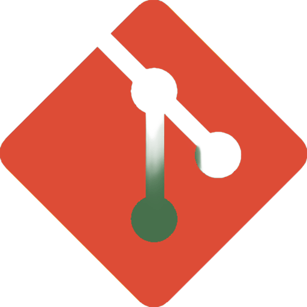

<h1 align="center"><em>Scriptics</em> 🔥🧯</h1>

---

## 📋 Project Overview

### <em>Our team, Scriptics presents a web-based platform designed to inform, protect, and engage communities in the face of natural disasters, with a focus on home and forest fires.</em>

The site allows users to:
- 📝 Submit reports of fire incidents using a simple, intuitive form.
- 📈 View real-time statistics and fire data visualizations.
- 📚 Learn more about the equipment and staff of our organisation.
- 🧑‍ Inform themselves about current natural disasters.

---

## 🖥️ Languages & Frameworks

      HTML5 
      CSS3 
      JavaScript 
      Node.js 
      Chart.js 

---

## 🎨 Design Tools

      MS Paint 

---

## 🤝 Collaboration Tools

      Microsoft Teams 
      GitHub 
    Git 

---

## 📁 Documents

### 📄 Documentation  
- Project documentation

### 🎤 Presentation  
- Presentation
  
---

## 🔧 Features

- 🔥 Fire incident reporting with live map integration (Leaflet.js)
- 📊 Real-time visualizations (Chart.js)
- 🧑‍🚒 Admin dashboard for managing personnel, vehicles & alerts
- 📱 Mobile-responsive design

---

## 👥 Team – Scriptics

| 👤 **Name**          | 🛠️ **Role**            | 🏫 **Class**|
|----------------------|------------------------|-------------|
| Vladimir Petkov      | Designer               | 🟨 9A       |
| Valeri Tenev         | Front-End Developer    | 🟥 9B       |
| Hristqn Stanchev     | Back-End Developer     | 🟩 9V        |
| Aleksandar Petrov    | Scrum Trainer          | 🟦 9G       |

---
