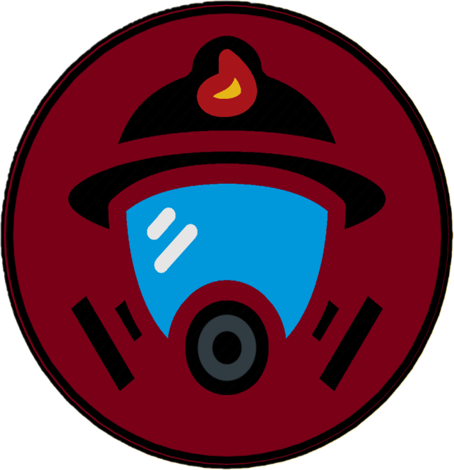

<h1 align="center"><em>Scriptics</em> 🔥🧯</h1>

---

## 📋 Project Overview

### <em>Our team, Scriptics presents a web-based platform designed to inform, protect, and engage communities in the face of natural disasters, with a focus on home and forest fires.</em>

The site allows users to:
- 📝 Submit reports of fire incidents using a simple, intuitive form.
- 📈 View real-time statistics and fire data visualizations.
- 📚 Learn more about the equipment and staff of our organisation.
- 🧑‍ Inform themselves about current natural disasters.

---

## 🖥️ Languages & Frameworks

      HTML5 
      CSS3 
      JavaScript 
      Node.js 
      Chart.js 

---

## 🎨 Design Tools

      MS Paint 

---

## 🤝 Collaboration Tools

      Microsoft Teams 
      GitHub 
    Git 

---

## 📁 Documents

### 📄 Documentation  
- Project documentation
https://codingburgas-my.sharepoint.com/:w:/r/personal/vnpetkov23_codingburgas_bg/_layouts/15/Doc.aspx?sourcedoc=%7BE18C8A5C-B92B-4513-8955-86F29B16E7A0%7D&file=%D0%94%D0%BE%D0%BA%D1%83%D0%BC%D0%B5%D0%BD%D1%82%D0%B0%D1%86%D0%B8%D1%8F%20%D0%BD%D0%B0%20Scriptics2_4d76972f-c577-48c8-aeb4-747f264eb64e%201.docx&action=default&mobileredirect=true&DefaultItemOpen=1
### 🎤 Presentation  
- Presentation
  https://codingburgas-my.sharepoint.com/:p:/r/personal/vnpetkov23_codingburgas_bg/_layouts/15/Doc.aspx?sourcedoc=%7B453FDE33-F9A3-45B4-AEDB-3249D00B27B2%7D&file=Scriptics_2d2027bd-952b-4668-a9ec-394f22aa2013%201.pptx&action=edit&mobileredirect=true&DefaultItemOpen=1
---

## 🔧 Features

- 🔥 Fire incident reporting with live map integration (Leaflet.js)
- 📊 Real-time visualizations (Chart.js)
- 🧑‍🚒 Admin dashboard for managing personnel, vehicles & alerts
- 📱 Mobile-responsive design

---

## 👥 Team – Scriptics

| 👤 **Name**          | 🛠️ **Role**            | 🏫 **Class**|
|----------------------|------------------------|-------------|
| Vladimir Petkov      | Designer               | 🟨 9A       |
| Valeri Tenev         | Front-End Developer    | 🟥 9B       |
| Hristqn Stanchev     | Back-End Developer     | 🟩 9V        |
| Aleksandar Petrov    | Scrum Trainer          | 🟦 9G       |

---
